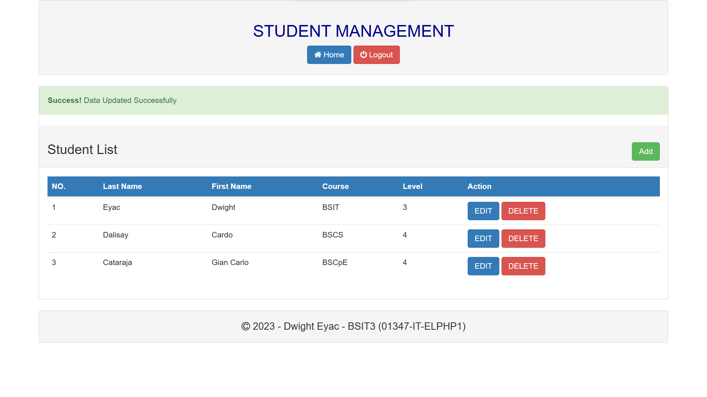

## Student Management (BASIC C-R-U-D)
Dwight Eyac 
BSIT3 
01347-IT-ELPHP1

Description: This is a basic create-read-update-delete for student management. This has a register page, login page, and the index page. 
Create a new database in phpmyadmin called studentmanagement. Import the [studentmanagement.sql](studentmanagement.sql) to the created database. 

### LOGIN DETAILS
(as provided with database, you can also register) 
username: admin 
password: admin

